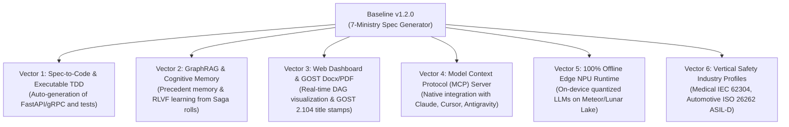
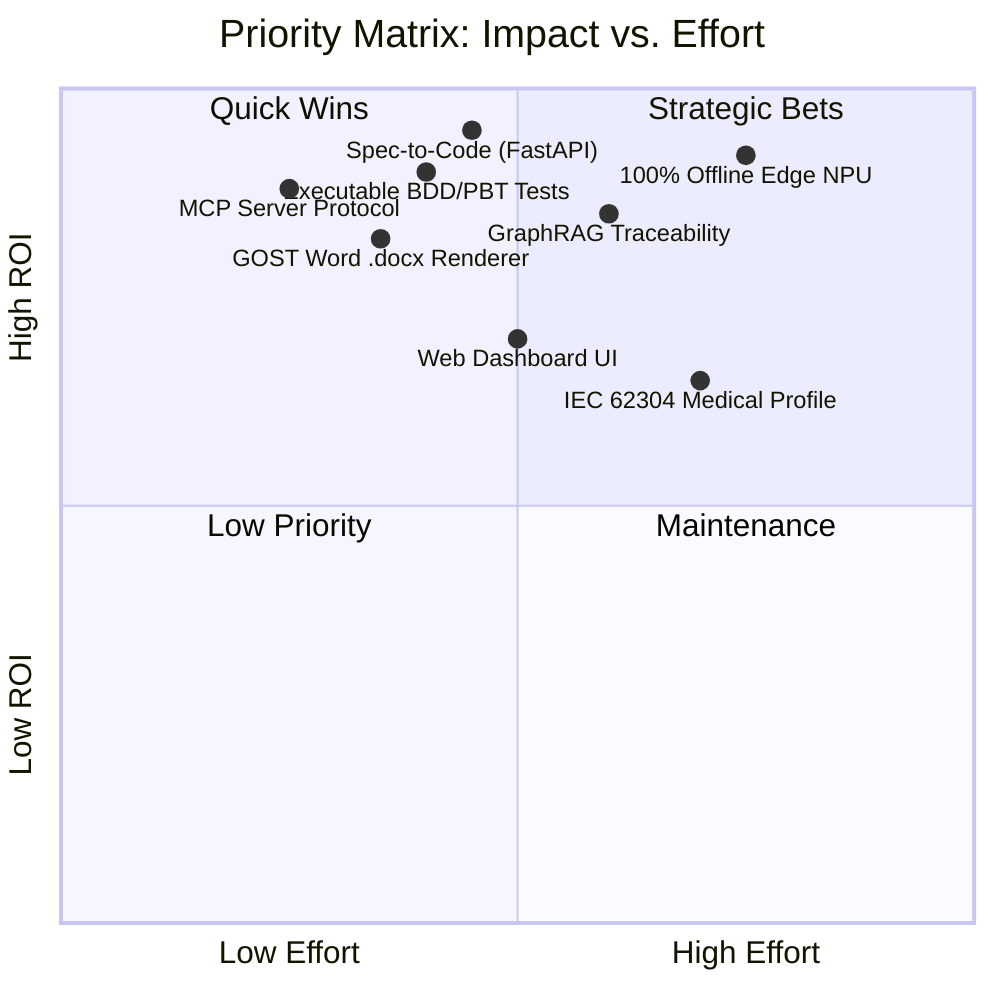

# Strategic Roadmap & Evolutionary Growth Vectors (2026–2027)
## Project: Cognitive Harness Architect (Universal Cognitive Decomposition Engine — UCDE)

[-success.svg)](output_artifacts/release_manifest.json)
[-brightgreen.svg)](tests/)

---

## 1. Current Baseline (v1.2.0)

`cognitive-harness-architect` has completed its foundational core:
- **7-Ministry DAG Engine:** Strict Pydantic V2 schema contracts covering Strategy, Finance, Legal, Infosec, Analysis, Hardware, and V&V Quality.
- **Saga Orchestrator:** Transactional state machine with automated rollback, compensating transactions, and Simplex Fail-Safe downgrades.
- **System 1 + System 2 Hybrid:** Local NPU INT8 / OpenVINO fast-path + Decisions L-MOPA Pareto selection + OpenRouter multi-hypothesis ensemble.
- **Formal Standards Verification:** Deterministic linter enforcing 37 rules across GOST 34.602, GOST 19.201 ESPD, FSTEC Orders № 17/21/239, FSTEC BDU threats (`^УБИ\.\d{3}$`), MADR 3.0 ADRs, IEC 61508 FMEA RPN ($\le 120$), ISO 29148, OWASP LLM Top 10, and FOCUS 1.0 FinOps.

---

## 2. Six Strategic Growth Vectors

---

## 3. High-Leverage Initiatives & New Modules

### Vector 1. Spec-to-Code & Executable TDD (Closing the Generation Loop)
- **Module 8 (`core/code_synthesizer.py`):** Automatically generate fully typed backend code from `SystemAnalysisContract` (OpenAPI 3.1 $\to$ FastAPI / gRPC).
- **Module 9 (`core/test_synthesizer.py`):** Automatically translate BDD Gherkin scenarios (`acceptance_criteria`) and business rules into executable `pytest-bdd` and `hypothesis` property-based tests.
- **Closed-Loop Sandbox:** Run generated code in an isolated container; on test failure, capture tracebacks into Saga compensation for autonomous self-healing.

### Vector 2. GraphRAG & Precedent Memory (RLVF)
- **Module 10 (`core/graph_rag_engine.py`):** In-memory knowledge graph (KùzuDB / NetworkX) linking:
  $$\text{AC} \to \text{BusinessRule} \to \text{STRIDE Threat} \to \text{Endpoint} \to \text{Hardware Component} \to \text{FMEA Mode} \to \text{Test Case}$$
- **Reinforcement Learning from Verification Feedback (RLVF):** Store historic Saga rollbacks to immediately generate dominant hypotheses without retry loops on future briefs.

### Vector 3. Web Dashboard & GOST Document Exporter
- **Interactive Web UI:** Real-time visualization of the 7-Ministry FSM states, Pareto front, MADR 3.0 ADR tradeoffs, and FMEA heatmaps.
- **GOST Word/PDF Engine (`core/doc_export/`):** Generate client-ready `.docx` and `.pdf` documents with automated tables of contents, official stamps, and formatting complying with **ГОСТ Р 7.0.97-2016** and **ГОСТ 2.104-2006**.

### Vector 4. Model Context Protocol (MCP) Server
- **Module 11 (`core/mcp_server.py`):** Expose UCDE as an MCP Server so developers in Cursor, Claude Desktop, Antigravity IDE, and VS Code can invoke decomposition and validation tools directly.

### Vector 5. 100% Offline Edge NPU Runtime
- **Module 12 (`core/edge_runtime.py`):** Enable zero-cloud, fully offline System 2 execution using quantized local models (Qwen-2.5-Coder-7B / DeepSeek-R1-Distill-8B) accelerated across Intel AI Boost NPU and Intel Arc iGPU via OpenVINO GenAI.

### Vector 6. Vertical Safety Profiles
- **Medical Profile:** IEC 62304 Software Life Cycle Classes (A, B, C) and ISO 14971 Risk Management.
- **Automotive Profile:** ISO 26262 ASIL A-D decomposition and MISRA C/C++ static analysis checks.
- **Aerospace Profile:** DO-178C / KT-178C Software Considerations in Airborne Systems (DAL A-E).

---

## 4. Implementation Roadmap by Phases

| Phase | Milestone | Scope | Target |
|---|---|---|---|
| **Phase 1** | **Spec-to-Code & Executable Tests** | Modules 8 & 9: FastAPI stub generator, pytest-bdd suite, self-healing sandbox | Q4 2026 |
| **Phase 2** | **MCP Server & GraphRAG** | Modules 10 & 11: MCP Tools for IDEs, KùzuDB knowledge graph, RLVF precedent memory | Q1 2027 |
| **Phase 3** | **Web UI & GOST Docx/PDF** | FastAPI/React Web Dashboard, GOST 34/19 Word template renderer with stamps | Q2 2027 |
| **Phase 4** | **100% Offline Edge & Safety Verticals** | Module 12: OpenVINO GenAI 7B/8B NPU runtime, IEC 62304 & ISO 26262 profiles | Q3 2027 |

---

## 5. Priority Matrix (Impact vs. Effort)

### Quick Wins (Recommended First Steps):
1. **MCP Server Integration:** Connect UCDE to Antigravity and Cursor in 1-2 days.
2. **GOST Word .docx Exporter:** Generate downloadable, client-ready Terms of Reference in Word format.
3. **Spec-to-Code Synthesizer:** Generate production backend code and BDD test suites from committed contracts.
