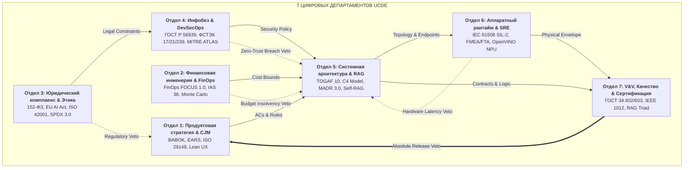
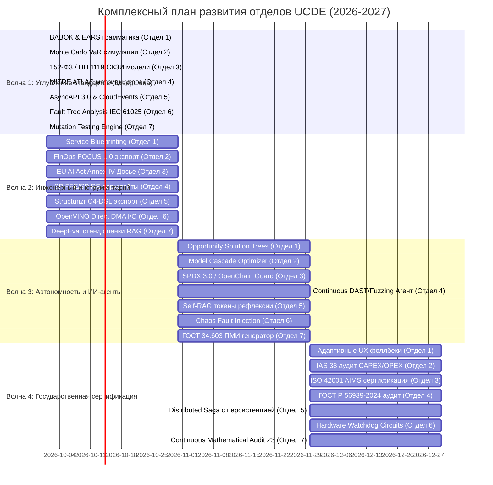

# Strategic Roadmap & Departmental Deep Evolution (2026–2027)
## Project: Cognitive Harness Architect (Universal Cognitive Decomposition Engine — UCDE v2.0.0+)

[-success.svg)](output_artifacts/release_manifest.json)
[-brightgreen.svg)](tests/)

---

## 1. Текущий производственный базис (v2.0.0)

В релизе `v2.0.0` реализована полномасштабная платформа автономного проектирования и верификации:
1. **7 Министерств (Pydantic V2):** Стратегия, Финансы, Право, Инфобез, Системный анализ, Аппаратный рантайм, V&V Качество.
2. **Spec-to-Code & Executable Tests:** Модули 8 и 9 (`CodeSynthesizer`, `TestSynthesizer`, `SandboxRunner`) с TDD-самоисцелением.
3. **GraphRAG & 4-Tier Cognitive Memory:** Ассоциативный граф знаний с RRF-поиском ($k=60$), семантическая память и защита от prompt injection (`<user_brief_quarantine>`).
4. **Z3 SMT Theorem Prover:** Математическое доказательство 5 теорем (CIDR, DAG, Therac-25, Solvency, STRIDE) за ~2 мс.
5. **PBFT Consensus & Canary Deployer:** 3-фазный византийский консенсус ($N \ge 3f + 1$) и прогрессивный деплой с автооткатом.
6. **9 MCP Tools:** Стандартный сервер Model Context Protocol (JSON-RPC 2.0).
7. **Тестовое покрытие:** 350 тестов (100% pass rate) со средним временем реджекции гипотез $\approx 6.9$ мкс ($< 1.0$ мс SLA).

---

## 2. Глубокие дорожные карты по отделам (Ноды 1–7)

Для достижения **100% инженерной зрелости** каждый узел развивается как специализированный Центр Компетенций (*Center of Excellence*).

---

### Отдел 1: Продуктовая стратегия, CJM и Бизнес-анализ (Нода 1)
- **Стандарты:** BABOK v3 (BACCM), ISO/IEC/IEEE 29148:2018 (9 атрибутов качества требований), грамматика EARS (*Easy Approach to Requirements Syntax*), Service Blueprinting (NN/g).
- **AI-Native особенности:** Разграничение уровней автономии (HITL vs Human-on-the-Loop), проектирование сценариев деградации интерфейса при снижении уверенности модели (*Graceful Degradation UX*).
- **Дорожная карта:**
  * **Q1:** Автоматический линтинг требований по синтаксису EARS и проверка 9 атрибутов ISO 29148.
  * **Q2:** Генерация полных Service Blueprints с делением на Frontstage/Backstage и трассировкой до эндпоинтов.
  * **Q3:** Внедрение Opportunity Solution Tree (OST) и деревьев бизнес-решений в нотации DMN 1.4.
  * **Q4:** Синтез адаптивных сценариев эскалации с ИИ на живого оператора.

---

### Отдел 2: Финансовая инженерия, Unit-экономика и FinOps (Нода 2)
- **Стандарты:** FinOps Framework FOCUS 1.0, МСФО (IAS 38 «Нематериальные активы» / IFRS 15), ISO 31000:2018 (стохастическое моделирование Монте-Карло, VaR/CFaR).
- **AI-Native особенности:** Инженерия затрат на токены (*AI Tokenomics*), каскадная маршрутизация (INT8 NPU $\to$ 70B $\to$ Frontier), оптимизация попаданий в контекстный кэш ($R_{cache} \ge 85\%$).
- **Дорожная карта:**
  * **Q1:** Модуль стохастического моделирования Монте-Карло (10,000 симуляций волатильности CAC и Churn).
  * **Q2:** Экспорт структуры затрат сервиса в открытую спецификацию FOCUS 1.0 (AWS, GCP, Yandex Cloud).
  * **Q3:** Оптимизатор каскада моделей (*Model Cascade Optimizer*) под целевой SLA и бюджет.
  * **Q4:** Автоматический аудиторский отчет признания нематериальных активов по IAS 38 (CAPEX vs OPEX).

---

### Отдел 3: Юридический комплаенс, Право и Этика ИИ (Нода 3)
- **Стандарты:** 152-ФЗ, 242-ФЗ (первичная локализация баз данных в РФ), Постановление Правительства РФ № 1119 (УЗ-1–УЗ-4), Приказы ФСТЭК № 21 и ФСБ № 378 (СКЗИ ГОСТ Р 34.12-2015), EU AI Act (Regulation 2024/1689), ISO/IEC 42001:2023 (AIMS), OpenChain (ISO 5230 / SPDX 3.0).
- **AI-Native особенности:** Автоматическое составление Досье соответствия EU AI Act (*Technical Documentation Annex IV*), аудит отсутствия предвзятости данных (*Bias Prevention*), защита от вирусных лицензий.
- **Дорожная карта:**
  * **Q1:** Генератор Моделей угроз персональным данным по методике ФСТЭК 2021 и требованиям Роскомнадзора.
  * **Q2:** Формирование Технического досье (Annex IV) для систем искусственного интеллекта по EU AI Act.
  * **Q3:** Интеграция статического сканера лицензий зависимостей OpenChain / SPDX 3.0 с вето на AGPL.
  * **Q4:** Сертификационный аудит системы менеджмента ИИ по стандарту ISO/IEC 42001:2023.

---

### Отдел 4: Информационная безопасность, DevSecOps и Zero-Trust (Нода 4)
- **Стандарты:** ГОСТ Р 56939-2024 (Безопасная разработка ПО), Приказы ФСТЭК № 17/21/239, БДУ ФСТЭК (`^УБИ\.\d{3}$`), NIST SP 800-207 (Zero Trust), OWASP ASVS 4.0 (Level 3), MITRE ATLAS & OWASP LLM Top 10 (2025).
- **AI-Native особенности:** Защита от prompt injection, отравления RAG-памяти (*Vector Poisoning*), кражи системных промптов, неконтролируемого исполнения действий агентами (*Excessive Agency*), идентификация воркстейтов через SPIFFE/SPIRE и mTLS (Ed25519 / ГОСТ).
- **Дорожная карта:**
  * **Q1:** Расширение STRIDE-матрицы 12 тактиками MITRE ATLAS против атак на когнитивные агенты.
  * **Q2:** Генератор конфигураций mTLS и агентов SPIFFE/SPIRE с ротацией сертификатов.
  * **Q3:** Автономный агент непрерывного фаззинга эндпоинтов и полезной нагрузки по FSTEC БДУ и OWASP ASVS.
  * **Q4:** Доказательный пакет соответствия ГОСТ Р 56939-2024 для сертификации ФСТЭК/ФСБ.

---

### Отдел 5: Системная архитектура, Интеграция и Когнитивный RAG (Нода 5)
- **Стандарты:** ISO/IEC/IEEE 42010:2022 (Architecture Description Viewpoints), TOGAF 10, C4 Model (Level 1–4, Structurizr DSL), MADR 3.0 ADR, OpenAPI 3.1, AsyncAPI 3.0, CloudEvents 1.0, Saga Pattern, Transactional Outbox, CQRS/Event Sourcing.
- **AI-Native особенности:** Гибридный RAG (BGE-M3 + BM25 + RRF $k=60$ + Cross-Encoder), архитектура саморефлексии **Self-RAG** (токены `[Retrieve]`, `[IsRel]`, `[IsSup]`), Model Context Protocol (MCP).
- **Дорожная карта:**
  * **Q1:** Поддержка генерации AsyncAPI 3.0 и CloudEvents 1.0 для шин сообщений (Kafka, Redis Streams).
  * **Q2:** Экспорт архитектуры в Structurizr C4-DSL с авторендерингом интерактивных диаграмм.
  * **Q3:** Внедрение токенов саморефлексии Self-RAG для подавления галлюцинаций до $< 0.1\%$.
  * **Q4:** Генератор распределенного оркестратора саг с персистентным журналом состояний.

---

### Отдел 6: Аппаратный рантайм, Надежность и SRE (Нода 6)
- **Стандарты:** IEC 61508:2010 (SIL-2 / SIL-3), ГОСТ Р 27.302-2009 / IEC 60812 (FMEA RPN $\le 120$), IEC 61025 (Fault Tree Analysis — FTA), IEEE 754-2019 (квантование FP16/INT8), Google SRE & Chaos Engineering.
- **AI-Native особенности:** Прямой DMA zero-copy доступ к NPU через OpenVINO Remote Context, физическая защита от гонок типа Therac-25 ($T_{sw} < T_{hw}$ или обязательный аппаратный релейный интерлок).
- **Дорожная карта:**
  * **Q1:** Построение деревьев неисправностей (FTA) с расчетом вероятности опасного отказа ($PFD < 10^{-2}$).
  * **Q2:** Zero-copy буферизация тензоров между NPU и системной памятью через OpenVINO Direct I/O.
  * **Q3:** Симулятор хаоса (Chaos Fault Injection) для стресс-тестирования сторожевых таймеров.
  * **Q4:** Автоматический синтез аппаратных сторожевых схем с независимым тактированием.

---

### Отдел 7: Верификация, Валидация, Качество и Сертификация (Нода 7)
- **Стандарты:** ГОСТ 34.602-89, ГОСТ 19.201-78, ГОСТ 34.603-92 (Виды испытаний АС), ГОСТ 19.301-79 (ПМИ), ISO/IEC/IEEE 29119-1..4 (BVA, Pairwise, Mutation), IEEE 1012:2016 (V&V Level 4), RAG Triad (Ragas / DeepEval), Z3 SMT Theorem Prover.
- **AI-Native особенности:** Оценка триады RAG (Context Relevance $\ge 0.85$, Groundedness $\ge 0.95$, Answer Relevance $\ge 0.90$), математические сертификаты доказательств Z3.
- **Дорожная карта:**
  * **Q1:** Модуль мутационного тестирования синтезированного кода (Mutation Score $\ge 85\%$).
  * **Q2:** Интеграция фреймворка Ragas/DeepEval для автоматизированного аудита ответов ИИ.
  * **Q3:** Автогенерация официальных Актов и Протоколов испытаний по ГОСТ 34.603-92.
  * **Q4:** Непрерывный математический аудит в CI/CD с блокировкой сборки при нарушении SMT-теорем.

---

## 3. Межведомственная матрица вето и компенсаций (Saga Protocol)

| Ветирующий отдел | Целевой отдел | Причина вето (Hazard Code) | Автоматическое компенсирующее действие ($C_k$) |
| :--- | :--- | :--- | :--- |
| **Отдел 6 (Hardware)** | **Отдел 5 (Architecture)** | `THERAC_COLLISION` ($T_{sw} \ge T_{hw}$) | Инвалидация эндпоинта. Требование обязательного включения аппаратного интерлока `/api/v1/hardware/interlock-status`. |
| **Отдел 4 (Security)** | **Отдел 5 (Architecture)** | `STRIDE_UNMITIGATED` | Блокировка маршрута. Принудительное включение Bearer mTLS Guard и добавление Rate Limiter. |
| **Отдел 2 (Finance)** | **Отдел 5 (Architecture)** | `BUDGET_INSOLVENCY` ($Cost > Budget$) | Снижение размерности эмбеддингов, включение префиксного кэширования $\ge 85\%$ или замена модели на локальную INT8. |
| **Отдел 3 (Legal)** | **Отдел 1 (Strategy)** | `AI_ACT_UNACCEPTABLE` | Полная блокировка сценария. Запрет биометрической или манипулятивной обработки данных. |
| **Отдел 7 (Quality)** | **Все отделы (1–6)** | `FORMAL_PROOF_UNSAT` | Остановка релиза. Перегенерация гипотез через Simplex Fail-Safe с понижением параметров. |

---

## 4. Сводный график реализации (4 Инженерные Волны)

